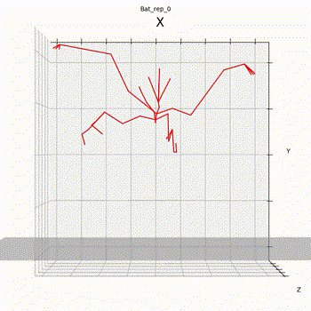
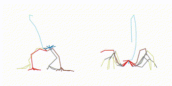
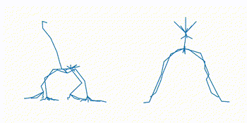
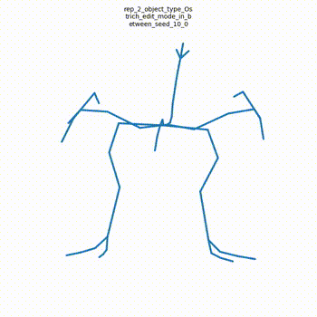
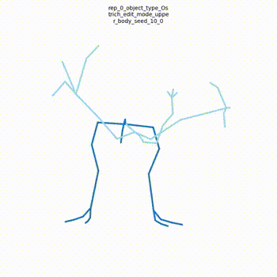

# AnyTop: Character Animation Diffusion with Any Topology

The official PyTorch implementation of the paper [**"AnyTop: Character Animation Diffusion with Any Topology"**]().

Please visit our [**webpage**](https://anytop2025.github.io/Anytop-page/) for more details.


## Update Notice

📢 September 25, 2025 – Important bug fix related to dataset preprocessing and handling unseen motions. If you are working with either, please pull the latest commits and rerun the preprocessing procedure.   
📢 June 2, 2025 – Blender visualization script released.   
📢 May 31, 2025 – Inpainting editing and Evaluation code uploaded.  
📢 April 27, 2025 – New models uploaded (minor bug fix) — Update your model paths.  
📢 April 27, 2025 – New cond.npy uploaded — Override your local file if you have already created the dataset.
  * To handle both updates above, simply remove the current cond.npy file from your dataset directory and re-run "Download Pretrained Models and Dataset Dependencies."
    
## Release Timeline

✅ April 6, 2025 – Training & inference code & preprocessing code  
✅ April 12, 2025 – Pretrained models  
✅ April 27, 2025 – DIFT feature correspondence code  
✅ May 31, 2025 – Editing and evaluation code  
✅ June 2, 2025 – Rendering code  
📌 *(Processed dataset temporarily withheld due to licensing clarification)*  

## Getting started

This code was tested on `Ubuntu 18.04.5 LTS` and requires:

* Python 3.8
* conda3 or miniconda3
* CUDA capable GPU (one is enough)

### 1. Setup environment
Setup conda env:
```shell
conda env create -f environment.yaml
conda activate anytop
pip install git+https://github.com/inbar-2344/Motion.git
```

### 2. Download and Preprocess Truebones dataset
Due to ongoing licensing clarification, we are currently not planning to publish the processed dataset. 
However, we provide everything you need to process it yourself using our preprocessing script:
(a) Download the full dataset from the [official Truebones website](https://truebones.gumroad.com/l/skZMC) 
(b) Place the Truebone_Z-OO directory inside our repository under ./datasets/truebones/zoo/
(c) Run the following command to begin preprocessing:
```shell
python -m utils.create_dataset
```
Note: The preprocessing may take several hours to complete, primarily due to inverse kinematics calculations and the generation of .mp4 files for each motion sequence.

### 3. Download Pretraind Models and dataset dependencies
Download pretrained models to ./save dorectory by running the following command:
```shell
python -m utils.download_dependencies
```

## Preprocessing new skeleton 
In addition to providing the preprocessing code for the full Truebones dataset, we also guide you through applying our pipeline to in-the-wild skeletons from any source-not just Truebones. This is useful for adapting new skeletons to our system, whether for inference on unseen characters or for training with alternative datasets.
While the preprocessing code was designed to be as generic and adaptable as possible, some skeleton-specific adjustments may still be required, as the pipeline was originally tailored to Truebones. For instance, it uses indicative joint name substrings for foot classification and predefined velocity/height thresholds for foot contact detection-heuristics that have worked well in our experiments with Truebones.
That said, we've tested the pipeline on BVH files from Mixamo and other sources to ensure its generalizability across different skeleton formats.

The script accepts the following input Arguments:
*object_name* - A character's indicative name (e.g., "Dog"). If the skeleton you wish to process is outside of Truebones dataset, 
please make sure the object name you choose does not already exist in Truebones charachters names. 
All of Truebones characters names can be found in Truebones_skeletons.txt file. 
*bvh_dir* - Directory containing BVH files of the skeleton. More files improve statistical accuracy for motion denormalization.
*face_joints_names* - Four joints defining skeleton orientation ([right hip, left hip, right shoulder, left shoulder] or equivalent). 
Used to align the skeleton to Z+ and XZ plane. Accepts joints names rather than indices since joints indices might change at loading.
*save_dir* - Output directory.
*tpos_bvh* - A BVH file of the character's natural rest pose for meaningful rotation learning. 
If missing, the code will search for a good candidate pose from the provided BVH files. 

Finally, you can run the command: 

```shell
python -m utils.process_new_skeleton --object_name Chicken --bvh_dir assets/Truebones_Chicken --save_dir dataset/truebones/zoo/Chicken --face_joints_names Bip01_R_Thigh Bip01_L_Thigh BN_Finger_R_01 BN_Finger_L_01 --tpos_bvh assets/Truebones_Chicken/Chicken_TPOSE.bvh
```

The code will create the following under save_dir:
save_dir/
        |_motions
        |_animations
        |_bvhs
        cond.npy
1. In motions directory, you will find npy files, which are the processed motion features of each bvh file. 
This is useful in case you would like to use this data for training.  Note that motions longer than 240 frames wil be splited into separate npy files (this statement holds for the following outputs as well). 
2. In animation directory, you will find mp4 files corresponding to each of the processed bvhs.  
This is a good sanity check that everything worked as expected. 
Note that face_joints_names are marked in blue and feet joints that are considered touching the ground are marked in green.
3. In bvhs dir you can find the processed bvhs (with the new orientation, scale etc.)
4. cond.npy contains the skeletons representation, including joints names ambeddings and graph conditions, which is a required input for motion synthesis. 
       
       
## Motion Synthesis

### Generate motion for skeleton from Truebones dataset
We categorize Truebones skeletons into five subsets: Bipeds, Quadrupeds, Millipeds, Snakes, and Flying Creatures.
In addition to a unified model trained on the entire dataset, we also trained specialized models for each subset (with Millipeds and Snakes grouped together).

The explicit skeleton-to-subset mapping and skeletons object_type is defined in dataset/truebones/zoo/Truebones_skeletons.txt
(see the lists: BIPEDS, QUADROPEDS, FLYING, and MILLIPEDS+SNAKES).

If you'd like to synthesize motion using our pre-trained models, ensure that all model checkpoint files are located in the ./save directory (this should already be the case if you've completed Step 3: Download Pretrained Models).

For example, to generate motion using models trained on flying objects, you can synthesize motion for one or more skeletons from the Flying subset using the following command:

```shell
python -m sample.generate  --model_path save/flying_model_dataset_truebones_bs_16_latentdim_128/model000229999.pt --object_type Parrot2 Bat --num_repetitions 3
```
As the code is fully generic, you can generate motion for unseen skeletons (that do not belong to the subset the model was trained on) using the exact same syntax. 
For example, you can explore synthesizing motions for the Ostrich skeleton using the FLYING subset model:
```shell
python -m sample.generate  --model_path save/flying_model_dataset_truebones_bs_16_latentdim_128/model000229999.pt --object_type Tyranno --num_repetitions 3
```

### Generate unseen skeleton outside of Truebones dataset
We support motion synthesis for skeletons outside of Truebones dataset, provided as bvh file/s. 
To do that, you must first run our pre-processing pipeline on the new skeleton to create cond.py file for the skeleton, as described in 
Preprocessing new skeleton section above. Once you've accomplish this part, you can synthesize motion of the new skeleton by running the command:

```shell
python -m sample.generate  --model_path <model_path> --object_type <skeleton_name> --num_repetitions 3 --cond_path <path_to_cond_npy_file>
```

**You may also define:**
* `--device` id.
* `--seed` to sample different seeds.
* `--motion_length` (text-to-motion only) in seconds (maximum is 9.8[sec]).

**Running those will get you:**

* `<object_type>_rep_<rep_id>_#<sample_id>.npy` file with xyz positions of the generated animation
* `<object_type>_rep_<rep_id>_#<sample_id>.mp4` a stick figure animation for each generated motion
* `<object_type>_rep_<rep_id>_#<sample_id>.bvh` bvh file of the generated motion

Stick figure animation looks something like this:



## Train AnyTop 

To reproduce the unified paper model, run:
```shell
python -m train.train_anytop --model_prefix all --objects_subset all --lambda_geo 1.0 --overwrite --balanced
```

To reproduce the bipeds paper model, run:
```shell
python -m train.train_anytop --model_prefix bipeds --objects_subset bipeds --lambda_geo 1.0 --overwrite --balanced
```

To reproduce the quadropeds paper model, run:
```shell
python -m train.train_anytop --model_prefix quadropeds --objects_subset quadropeds --lambda_geo 1.0 --overwrite --balanced
```
To reproduce the millipeds paper model, run:
```shell
python -m train.train_anytop --model_prefix millipeds_snakes --objects_subset millipeds_snakes --lambda_geo 1.0 --overwrite --balanced
```

To reproduce the flying animals paper model, run:
```shell
python -m train.train_anytop --model_prefix flying --objects_subset flying --lambda_geo 1.0 --overwrite --gen_during_training --balanced
```
* **General instructions** Checkout './utils/parser_utils.py' to view all configurable parameters and default settings. '--balanced' flag is used to activate the balancing sampler, ensuring fair sampling of all skeletons. Use '--overwrite' flag if you wish to resume training of previous checkpoint. 
* **Recommended:** Add `--gen_during_training` to generate motions for each saved checkpoint. 
  This will slow down training but will give you better monitoring.
* **Recommended:** Add `--use_ema` for Exponential Moving Average to improve performance.
* Use `--diffusion_steps 50` to train the faster model with less diffusion steps.
* Use `--device` to define GPU id.
* Add `--train_platform_type {WandBPlatform, TensorboardPlatform}` to track results with either [WandB](https://wandb.ai/site/) or [Tensorboard](https://www.tensorflow.org/tensorboard).

## Correspondence
We release our correspondence code for both joint-level and temporal matching.
### Joints Correspondence
Our joint correspondence module finds, for each joint in a target skeleton, its best matching joint in a reference skeleton.
For better visualization, we color the joints of the Monkey skeleton (used as the reference).

The script accepts one or more motions from the Truebones processed dataset as input and computes joint correspondences to a reference Monkey motion.
Note: The motion you choose for the target skeleton can affect the resulting correspondences.

```shell
python -m sample.dift_correspondence --dift_type spatial --model_path save/all_model_dataset_truebones_bs_16_latentdim_128/model000459999.pt --sample_tgt assets/Scorpion___SlowForward_837.npy
```
Running this will create a new directory dift_out under the model’s directory, where the joint correspondences are saved as both .npy and .mp4 files (for visualization).
The output looks like:
<div style="text-align: left; margin-top: 20px;">

</div>

### Temporal Correspondence
Our temporal correspondence module matches each frame of a target motion to its most similar frame in a reference motion.
For better visualization, we also provide a segmentation of frames from a Monkey motion as the reference.

To test it on target skeletons from the Truebones processed dataset, run:

```shell
python -m sample.dift_correspondence --dift_type temporal --model_path save/all_model_dataset_truebones_bs_16_latentdim_128/model000459999.pt --sample_tgt assets/Hound___Attack_470.npy --layer 3 --timestep 1
```
This will also create a dift_out directory under the model’s directory, saving the temporal correspondences as both .npy and .mp4 files. The output looks like:
<div style="text-align: left; margin-top: 20px;">

</div>

## Editing
We support the two modes presented in the paper: in_between and upper_body.
### In-between 
```shell
python -m sample.edit --edit_mode in_between --model_path save/bipeds_model_dataset_truebones_bs_16_latentdim_128/model000329999.pt --object_type Ostrich --samples 'assets/Ostrich___Attack_581.npy' --num_repetitions 3
```
* **Optional:**  You can specify how many frames at the beginning and end of each input sample should remain fixed using the --prefix_end and --suffix_start arguments, respectively. By default, prefix_end is set to 0.25 and suffix_start is set to 0.75.
This means that the first 25% and last 25% of the frames are fixed, while the middle 50% are generated.
The output format is the same as described in the Motion Synthesis / Correspondence section above.
The resulting .mp4 file should appear as:

<div style="text-align: left; margin-top: 20px;">

</div>

### Upper-body
```shell
python -m sample.edit --edit_mode upper_body --model_path save/bipeds_model_dataset_truebones_bs_16_latentdim_128/model000329999.pt --object_type Ostrich --samples 'assets/Ostrich___Attack_581.npy' --upper_body_root 26 --num_repetitions 3
```
* `--upper_body_root` specifies a list of joint indices that define the roots of the upper body sub-tree in the character's skeleton. By default, it is set to 0, which means the entire skeleton will be generated.
Output .mp4 file should look something like:
<div style="text-align: left; margin-top: 20px;">

</div>

## Visualizing Motions in Blender
We provide a script to visualize motion data as animated skeletons in Blender, similar to the figures shown in the paper.
The script accepts either a single .bvh file or a directory containing multiple .bvh files. For each file, it generates a corresponding .blend file with the skeleton animation rendered in an empty scene.
**Note**: To export an .mp4 render, you'll need to manually set up lighting and position the camera in the Blender UI.  
Before running the command below, make sure to install the following dependencies in Blender’s Python environment:
* git+https://github.com/inbar-2344/Motion.git
* tqdm
* scipy

To create visualizations for all .bvh files in assets/Truebones_Chicken, run:
```shell
blender -b -P visualization/bvh2skeleton.py -- --bvh_path assets/Truebones_Chicken --save_dir save/blend_files --subset bipeds
```
* **Customization** You can adjust the visualization using --sphere_radius (joint sphere radius), --cylinder_radius (bone cylinder radius), and --scale (global scale factor).

## Acknowledgments
We want to thank the following contributors that our code is based on:
[mdm](https://github.com/GuyTevet/motion-diffusion-model), [GRPE](https://github.com/lenscloth/GRPE/tree/master), [audiocraft](https://github.com/facebookresearch/audiocraft)

## License
This code is distributed under an [MIT LICENSE](LICENSE).
Note that our code depends on other libraries that have their own respective licenses that must also be followed.
